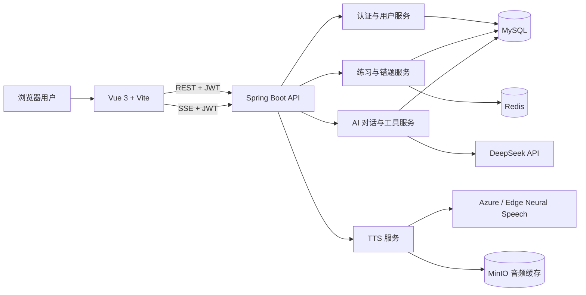

# TypEnglish

TypEnglish 是一个 AI 驱动的英语学习平台，围绕“练习、记录、复习、再练习”构建学习闭环。系统支持单词拼写、句子翻译、完形填空、错题复习、AI 出题、AI 助教、神经语音朗读和学习数据统计。

> 当前仓库是前后端分离项目。前端默认运行在 `5173` 端口，后端默认运行在 `8080` 端口。

## 目录

- [功能概览](#功能概览)
- [技术栈](#技术栈)
- [系统架构](#系统架构)
- [项目结构](#项目结构)
- [环境要求](#环境要求)
- [快速开始](#快速开始)
- [配置参数](#配置参数)
- [使用指南](#使用指南)
- [数据存储与缓存](#数据存储与缓存)
- [API 概览](#api-概览)
- [生产环境部署](#生产环境部署)
- [测试与构建](#测试与构建)
- [常见问题](#常见问题)
- [安全建议](#安全建议)

## 功能概览

### 练习系统

- **单词拼写**：根据中文释义输入完整单词，支持提示、跳过、朗读和快捷键。
- **句子翻译**：按空位填写句子，逐词反馈正确与错误状态。
- **完形填空**：结合上下文补全缺失单词；跳过的空位会按错误计入结算。
- **练习结算**：展示正确率、正确/错误数量、经验值和逐题详情。
- **个性化会话**：创建练习时优先加入已到复习时间的错题，再补充新词。

### 错题本与间隔复习

- 自动收集单词错题和句子错题。
- 保存错误次数、用户答案、错误空位和练习时间。
- 支持单题重练、批量练习、清空和标记掌握。
- 单词错题使用 SM-2 风格的间隔复习调度，根据正确性、尝试次数、提示和跳过情况安排下次复习。

### AI 出题

- 按主题、数量、难度和语言生成单词或句子。
- 生成内容写入 `word_bank` 或 `sentence_bank`，可立即用于练习。
- 句子批量生成使用 SSE（Server-Sent Events，服务端事件流）实时推送进度。
- 流式句子生成单次最多 200 条，后端按每批 10 条执行。

### AI 助教

- 支持流式多轮对话和 Markdown 内容展示。
- 对话、消息和工具执行结果持久化到 MySQL。
- 每个用户只能访问自己的对话和学习数据。
- AI 可调用 11 个学习工具：

| 工具能力 | 说明 |
|---|---|
| 单词错题查询 | 获取当前用户未掌握的单词错题 |
| 句子错题查询 | 获取当前用户未掌握的句子错题 |
| 练习统计 | 汇总题量、正确数、正确率和模式分布 |
| 近期练习 | 查看最近练习，最多 50 条 |
| 薄弱点分析 | 按错误次数识别薄弱词 |
| 单词详情 | 查询音标、释义、词性、例句和难度 |
| 下一轮推荐 | 根据到期错题和近期表现推荐练习 |
| 创建个性化练习 | 生成带“开始练习”入口的练习卡片 |
| 学习趋势 | 汇总 7 至 90 天的题量、正确率和连续学习天数 |
| AI 生成单词 | 按主题和难度生成单词并写入词库 |
| AI 生成句子 | 按主题和难度生成句子并写入句库 |

### 语音朗读

朗读采用多级降级策略：

1. 配置 Azure Speech 时，后端使用 Azure Neural Voice。
2. 未配置 Azure Speech 时，后端使用 Edge Neural Speech 兼容接口。
3. 后端请求失败时，前端降级到浏览器 Web Speech API。
4. 配置 MinIO 后，生成的 MP3 按文本、语言、音色和语速计算 SHA-256 缓存键并持久化，避免重复调用语音服务。

后端返回 `X-TTS-Cache` 响应头：

- `HIT`：从 MinIO 命中缓存。
- `MISS`：未命中，完成合成后已写入 MinIO。
- `BYPASS`：未启用 MinIO，直接返回合成结果。

### 学习记录与等级

- 汇总练习总数、正确数和正确率。
- 展示分页练习记录和最近 30 天热力图。
- 支持经验值、等级和升级进度。

## 技术栈

| 层级 | 技术 |
|---|---|
| Web 前端 | Vue 3.5、TypeScript 6、Vite 8、Pinia、Vue Router、Element Plus、Axios |
| 后端 | Java 17、Spring Boot 4、Spring Web MVC、Spring AI 2 |
| AI 模型 | DeepSeek OpenAI 兼容接口，当前模型配置为 `deepseek-v4-flash` |
| 数据访问 | MyBatis-Plus 3.5、MySQL Connector/J |
| 数据库 | MySQL 8，SQL 使用 `utf8mb4_0900_ai_ci` 排序规则 |
| 缓存 | Redis、MinIO/S3 兼容对象存储 |
| 认证 | JWT Bearer Token、BCrypt 密码哈希 |
| 实时通信 | SSE 流式对话和流式出题 |
| 测试 | Spring Boot Test、JUnit 5 |

## 系统架构



### 关键数据流

**登录请求**

```text
账号密码 -> BCrypt 校验 -> 生成 JWT -> 前端保存 token
        -> 后续 /api/** 请求附带 Authorization: Bearer <token>
```

**练习闭环**

```text
到期错题 + 新题 -> 用户作答 -> 记录结果 -> 更新错题本/SM-2
              -> 结算与经验值 -> 记录页/AI 助教分析
```

**AI 对话**

```text
用户消息 -> 创建/校验对话归属 -> 保存消息 -> DeepSeek + 用户级工具
        -> SSE 推送文本与工具状态 -> 保存完整回复和练习入口
```

**TTS 缓存**

```text
文本 + 语言 + 音色配置 -> SHA-256 缓存键 -> 查询 MinIO
                    -> 命中: 返回 MP3
                    -> 未命中: 语音合成 -> 写入 MinIO -> 返回 MP3
```

## 项目结构

```text
lingua-learn/
├── frontend/                         # Vue 3 前端
│   ├── src/
│   │   ├── api/                      # Axios 客户端和 API 类型
│   │   ├── components/               # 导航、对话侧栏、结算等公共组件
│   │   ├── composables/              # TTS、提示音、查词、经验值等逻辑
│   │   ├── router/                    # 页面路由与登录守卫
│   │   ├── stores/                    # 登录和错题本状态
│   │   └── views/                     # 首页、练习、错题、记录、AI 页面
│   ├── package.json
│   └── vite.config.ts                 # 开发服务器及 /api 代理
├── backend/                          # Spring Boot 后端
│   ├── db/lingua_learn.sql            # 完整数据库转储及示例数据
│   ├── src/main/java/com/typenglish/
│   │   ├── common/                    # 统一响应和异常处理
│   │   ├── config/                    # Web、Redis、MyBatis、异步线程池
│   │   ├── controller/                # REST/SSE 接口
│   │   ├── dto/                       # 请求/响应对象
│   │   ├── entity/                    # 数据库实体
│   │   ├── mapper/                    # MyBatis-Plus Mapper
│   │   ├── security/                  # JWT 工具和拦截器
│   │   └── service/                   # 业务、AI、复习和 TTS 服务
│   ├── src/main/resources/application.yml
│   ├── src/test/                      # 后端单元测试
│   ├── .env.example                   # Azure/MinIO 参数示例
│   └── pom.xml
├── scripts/                           # 词库生成与导入脚本
├── docs/wechat-miniprogram-guide.md   # 微信小程序适配指南
├── shared/types.ts                    # 跨端类型草案
└── README.md
```

## 环境要求

### 必需组件

- JDK 17
- Maven 3.9 或更高版本
- Node.js `20.19+` 或 `22.12+`
- npm 10 或兼容版本
- MySQL 8.0+；推荐 MySQL 8.4，以兼容仓库 SQL 的排序规则
- Redis 6+
- DeepSeek API Key

### 可选组件

- Azure Speech Key 和区域：使用官方 Azure Neural Voice。
- MinIO：持久化 TTS 音频，减少等待和语音 API 调用。
- Nginx：生产环境托管前端并反向代理后端。
- Python 3：仅在重新生成或导入词库时需要。

## 快速开始

以下命令以 PowerShell 为例。Linux/macOS 请将 `$env:NAME='value'` 改为 `export NAME='value'`。

### 1. 创建数据库

```powershell
mysql -u root -p -e "CREATE DATABASE lingua_learn CHARACTER SET utf8mb4 COLLATE utf8mb4_0900_ai_ci;"
mysql -u root -p lingua_learn < backend/db/lingua_learn.sql
```

`backend/db/lingua_learn.sql` 是完整转储文件，会先执行 `DROP TABLE IF EXISTS`，并包含示例用户、练习、对话和词库数据。请勿直接导入到已有生产库；生产使用前应先审查并移除不需要的示例 `INSERT`。

### 2. 启动 Redis

确保 Redis 可从 `localhost:6379` 访问。当前 `application.yml` 只允许通过 `REDIS_PASS` 配置密码，主机和端口仍固定为本机。

如果 Redis 没有密码，可在本地配置文件中将：

```yaml
spring:
  data:
    redis:
      password: ""
```

或使用与你的 Redis 实例一致的 `REDIS_PASS`。

### 3. 配置并启动后端

先确认 Java 和 Maven 使用的是同一个 JDK 17：

```powershell
java -version
mvn -v
```

两条命令都应显示 Java 17。只安装 JRE 或 Maven 仍指向 Java 8 时，Spring Boot 4 和 JUnit 依赖无法运行；请安装 JDK 17，并让 `JAVA_HOME` 指向该 JDK 后重新打开终端。

```powershell
cd backend

$env:DEEPSEEK_API_KEY='replace-with-your-deepseek-key'
$env:MYSQL_HOST='localhost'
$env:MYSQL_PORT='3306'
$env:MYSQL_DB='lingua_learn'
$env:MYSQL_USER='root'
$env:MYSQL_PASS='replace-with-your-mysql-password'
$env:REDIS_PASS='replace-with-your-redis-password'
$env:JWT_SECRET='replace-with-a-long-random-production-secret'

mvn spring-boot:run
```

仓库没有 `mvnw`，因此需要系统已安装 Maven。后端启动成功后监听：

```text
http://localhost:8080
```

### 4. 启动前端

新开一个终端：

```powershell
cd frontend
npm ci
npm run dev
```

访问：

```text
http://localhost:5173
```

Vite 会把前端使用的相对 `/api` 请求代理到 `http://localhost:8080`。Axios 客户端目前也直接使用该后端地址，因此本地开发无需额外配置。

### 5. 注册并验证

在登录页切换到注册，填写：

- 用户名：2 至 20 个字符
- 邮箱：合法邮箱地址
- 密码：6 至 32 个字符

注册成功后系统会自动保存 JWT 并进入首页。也可以直接验证后端：

```powershell
$body = @{ account = 'your-name'; password = 'your-password' } | ConvertTo-Json
Invoke-RestMethod -Method Post -Uri 'http://localhost:8080/api/auth/login' -ContentType 'application/json' -Body $body
```

## 配置参数

后端从系统环境变量读取以下配置。`backend/.env.example` 只是参考文件，Spring Boot 不会自动加载普通 `.env`；请在启动进程、IDE Run Configuration、systemd 或容器配置中注入变量。

### 后端配置

| 环境变量 | 必需 | 默认值 | 用途 |
|---|---:|---|---|
| `DEEPSEEK_API_KEY` | 是 | 无 | DeepSeek OpenAI 兼容接口密钥；缺失时 AI 相关 Bean 或请求可能失败 |
| `MYSQL_HOST` | 否 | `localhost` | MySQL 主机 |
| `MYSQL_PORT` | 否 | `3306` | MySQL 端口 |
| `MYSQL_DB` | 否 | `lingua_learn` | 数据库名 |
| `MYSQL_USER` | 否 | `root` | 数据库用户名 |
| `MYSQL_PASS` | 否 | `123456` | 数据库密码；生产环境必须覆盖 |
| `REDIS_PASS` | 否 | `123456` | Redis 密码；主机和端口当前固定为 `localhost:6379` |
| `JWT_SECRET` | 否 | 开发用默认值 | JWT HMAC 密钥；生产环境必须覆盖并保持稳定 |
| `AZURE_SPEECH_KEY` | 否 | 空 | Azure Speech 订阅密钥；空值时使用 Edge Neural Speech 兜底 |
| `AZURE_SPEECH_REGION` | 否 | `eastus` | Azure Speech 资源区域，如 `eastasia` |
| `MINIO_ENDPOINT` | 否 | `http://localhost:9000` | MinIO/S3 兼容 API 地址，不是控制台地址 |
| `MINIO_ACCESS_KEY` | 否 | 空 | MinIO Access Key；与 Secret Key 同时配置才启用缓存 |
| `MINIO_SECRET_KEY` | 否 | 空 | MinIO Secret Key；与 Access Key 同时配置才启用缓存 |
| `MINIO_TTS_BUCKET` | 否 | `lingua-learn-tts` | TTS 音频桶；不存在时后端自动创建 |

代码中还有以下固定配置：

| 配置 | 当前值 | 位置 |
|---|---|---|
| 后端端口 | `8080` | `backend/src/main/resources/application.yml` |
| Redis 地址 | `localhost:6379` | `backend/src/main/resources/application.yml` |
| JWT 有效期 | `604800000 ms`，即 7 天 | `backend/src/main/resources/application.yml` |
| DeepSeek Base URL | `https://api.deepseek.com` | `backend/src/main/resources/application.yml` |
| DeepSeek 模型 | `deepseek-v4-flash` | `backend/src/main/resources/application.yml` |
| 前端 Axios API 地址 | `http://localhost:8080/api` | `frontend/src/api/index.ts` |

### Azure Speech 配置

创建 Azure Speech 资源后，在 Azure Portal 的“Keys and Endpoint”页面获取 Key 和 Region，然后设置：

```powershell
$env:AZURE_SPEECH_KEY='replace-with-your-azure-speech-key'
$env:AZURE_SPEECH_REGION='eastasia'
```

区域必须与创建 Speech 资源时选择的区域一致。Azure Key 配置错误时，后端通常会记录语音服务的 HTTP 错误，前端随后降级到浏览器语音。

### MinIO TTS 缓存配置

本地可使用 Docker 启动 MinIO：

```powershell
docker run -d --name typenglish-minio `
  -p 9000:9000 -p 9001:9001 `
  -e MINIO_ROOT_USER=replace-with-minio-user `
  -e MINIO_ROOT_PASSWORD=replace-with-a-strong-minio-password `
  -v typenglish-minio-data:/data `
  minio/minio server /data --console-address ":9001"
```

后端配置：

```powershell
$env:MINIO_ENDPOINT='http://localhost:9000'
$env:MINIO_ACCESS_KEY='replace-with-minio-user'
$env:MINIO_SECRET_KEY='replace-with-a-strong-minio-password'
$env:MINIO_TTS_BUCKET='lingua-learn-tts'
```

重启后端后第一次朗读应返回 `X-TTS-Cache: MISS`，再次朗读相同文本应返回 `X-TTS-Cache: HIT`。MinIO 控制台地址是 `http://localhost:9001`，对象存储 API 地址是 `http://localhost:9000`。

## 使用指南

### 首页

首页展示学习入口、词库分类、待复习内容和学习概览。选择分类后可开始对应词库的练习。

### 开始一轮练习

1. 从首页、错题本或 AI 助教的练习卡片进入练习页。
2. 按题目输入答案，也可使用朗读、提示或跳过。
3. 完成整轮后查看结算动画、正确率和逐题详情。
4. 错题会自动进入错题本；到期错题会优先进入之后的练习会话。

### 使用错题本

1. 在导航栏进入“错题本”。
2. 切换“单词错题”或“句子错题”。
3. 单词列表支持逐词朗读和批量拼写练习。
4. 句子列表直接用红色标记错误词，并保留用户答案。
5. 重新作答后，后端更新掌握状态和下一次复习时间。

### 使用 AI 出题

1. 进入“AI 出题”。
2. 选择生成单词或句子。
3. 设置主题、数量和 1 至 5 级难度。
4. 单词生成完成后写入词库；句子会分批生成并显示实时进度。
5. 避免重复提交：模型生成和数据库写入都需要时间，等待进度完成后再操作。

### 使用 AI 助教

可以直接询问：

- “分析我最近 14 天的学习趋势。”
- “找出我最薄弱的单词。”
- “根据我的情况推荐下一轮练习，然后帮我开始。”
- “解释 abandon 和 desert 的区别。”
- “生成 10 个旅行主题、难度 3 的英语单词。”

AI 创建练习后会返回可点击的练习卡片。该卡片会随 AI 消息一起保存在数据库中，重新进入对话后仍可使用。

### 使用朗读

第一次合成可能需要数秒，前端会显示当前单词或句子的加载状态。重复文本在启用 MinIO 后直接读取持久化音频缓存。

`/api/tts` 受 JWT 保护，直接在浏览器地址栏打开不会自动带上 `Authorization` 请求头，即使登录过也会返回 `401`。应由前端按钮调用，或手动携带 Bearer Token：

```bash
curl -D - \
  -H "Authorization: Bearer YOUR_JWT_TOKEN" \
  "http://localhost:8080/api/tts?text=hello&lang=en-US" \
  --output hello.mp3
```

## 数据存储与缓存

### MySQL 表

| 表 | 作用 |
|---|---|
| `user` | 用户账号、BCrypt 密码、等级和经验值 |
| `word_bank` | 单词、音标、释义、词性、例句、分类、难度和 COCA 排名 |
| `sentence_bank` | AI 或预置句子及中英文内容 |
| `practice_record` | 单词练习记录和用户答案 |
| `error_book` | 单词错题及 SM-2 调度字段 |
| `sentence_error` | 句子错题、每个空位结果和掌握状态 |
| `ai_conversation` | AI 对话元数据及用户归属 |
| `ai_conversation_message` | 用户/助教消息及持久化工具执行数据 |

### Redis

Redis 用于单词查询的多级缓存：

```text
Redis -> MySQL -> AI 补全
```

- 正常查询结果缓存 7 天。
- 未查询到的结果短暂缓存 5 分钟，减少重复穿透。
- Redis 不保存 TTS 音频，也不是 AI 对话的持久化存储。

### MinIO

MinIO 只保存 TTS MP3。对象路径格式为：

```text
audio/<sha256>.mp3
```

音频缓存不需要数据库表。确定性缓存键已经能从请求内容定位对象；MySQL 只负责业务数据和对话持久化。

## API 概览

除 `/api/auth/register` 和 `/api/auth/login` 外，所有 `/api/**` 接口都需要：

```http
Authorization: Bearer <JWT_TOKEN>
```

普通 JSON 接口使用统一响应格式：

```json
{
  "code": 200,
  "msg": "ok",
  "data": {}
}
```

### 认证

| 方法 | 路径 | 说明 |
|---|---|---|
| `POST` | `/api/auth/register` | 注册并返回 JWT |
| `POST` | `/api/auth/login` | 使用用户名或邮箱登录 |

### 词库与句库

| 方法 | 路径 | 说明 |
|---|---|---|
| `GET` | `/api/categories` | 查询词库分类 |
| `GET` | `/api/words` | 分页查询单词 |
| `GET` | `/api/words/lookup` | Redis → MySQL → AI 单词查询 |
| `POST` | `/api/words/import` | 批量导入单词 |
| `DELETE` | `/api/words/{id}` | 删除单词 |
| `DELETE` | `/api/words/category` | 按语言和分类删除单词 |
| `GET` | `/api/sentences` | 随机获取句子 |
| `DELETE` | `/api/sentences/{id}` | 删除句子 |

### 练习与错题

| 方法 | 路径 | 说明 |
|---|---|---|
| `POST` | `/api/practice/session` | 创建个性化练习会话 |
| `POST` | `/api/practice/submit` | 提交单题结果 |
| `POST` | `/api/practice/submit-batch` | 批量提交结果 |
| `POST` | `/api/practice/sentence-error` | 保存句子错题 |
| `GET` | `/api/practice/stats` | 获取练习统计 |
| `GET` | `/api/practice/records` | 分页查询练习记录 |
| `GET` | `/api/practice/daily-stats` | 查询最近 1 至 90 天统计 |
| `GET` | `/api/errorbook` | 分页查询单词错题 |
| `GET` | `/api/errorbook/sentences` | 分页查询句子错题 |
| `GET` | `/api/errorbook/due` | 查询到期复习项 |
| `POST` | `/api/errorbook/review/{errorBookId}` | 提交复习结果并更新间隔 |
| `PUT` | `/api/errorbook/sentences/{id}` | 更新句子错题结果 |
| `DELETE` | `/api/errorbook/{id}` | 将单词错题标记为掌握 |
| `DELETE` | `/api/errorbook/sentences/{id}` | 将句子错题标记为掌握 |
| `DELETE` | `/api/errorbook/clear-all` | 清空当前用户的单词错题 |
| `DELETE` | `/api/errorbook/sentences/clear-all` | 清空当前用户的句子错题 |

### AI 与语音

| 方法 | 路径 | 说明 |
|---|---|---|
| `GET` | `/api/ai/conversations` | 获取当前用户的对话列表 |
| `GET` | `/api/ai/conversation/{id}/messages` | 获取对话消息 |
| `PUT` | `/api/ai/conversation/{id}/title` | 修改对话标题 |
| `DELETE` | `/api/ai/conversation/{id}` | 删除对话 |
| `POST` | `/api/ai/chat` | 非流式 AI 对话 |
| `POST` | `/api/ai/chat/stream` | SSE 流式 AI 对话和工具状态 |
| `POST` | `/api/ai/generate-words` | 生成单词并入库 |
| `POST` | `/api/ai/generate-sentences` | 非流式生成句子并入库 |
| `POST` | `/api/ai/generate-sentences-stream` | SSE 分批生成句子并推送进度 |
| `GET` | `/api/tts` | 返回 `audio/mpeg` 朗读音频 |

### 用户经验值

| 方法 | 路径 | 说明 |
|---|---|---|
| `GET` | `/api/user/xp` | 获取等级和经验值 |
| `POST` | `/api/user/xp/gain` | 增加经验值 |

## 生产环境部署

当前仓库没有 Dockerfile、Compose 文件或 Nginx 配置，下面是可工作的传统 Linux 部署方式。

### 1. 准备生产配置

生产环境至少设置：

```bash
export DEEPSEEK_API_KEY='replace-with-production-key'
export MYSQL_HOST='127.0.0.1'
export MYSQL_PORT='3306'
export MYSQL_DB='lingua_learn'
export MYSQL_USER='typenglish'
export MYSQL_PASS='replace-with-strong-database-password'
export REDIS_PASS='replace-with-redis-password'
export JWT_SECRET='replace-with-at-least-32-random-characters'
```

按需增加 Azure 和 MinIO 变量。不要把真实值提交到 Git。

### 2. 调整前端生产 API 地址

`frontend/src/api/index.ts` 当前硬编码为：

```ts
baseURL: 'http://localhost:8080/api'
```

这只适合本地开发。生产构建前应改为同源地址：

```ts
baseURL: '/api'
```

AI 对话和 AI 出题的流式请求已经使用相对 `/api` 路径。改为同源后，可以由 Nginx 统一代理，也能避免 HTTPS 页面请求 HTTP API 的混合内容问题。

### 3. 构建后端

```bash
cd backend
mvn clean package
java -jar target/typ-english-1.0.0.jar
```

构建会运行测试。只需要打包且明确接受跳过测试时，才使用 `mvn clean package -DskipTests`。

### 4. 构建前端

```bash
cd frontend
npm ci
npm run build
```

产物位于 `frontend/dist/`。

### 5. 配置 Nginx

将前端产物复制到 `/var/www/typenglish`，示例配置：

```nginx
server {
    listen 80;
    server_name learn.example.com;

    root /var/www/typenglish;
    index index.html;

    location / {
        try_files $uri $uri/ /index.html;
    }

    location /api/ {
        proxy_pass http://127.0.0.1:8080/api/;
        proxy_http_version 1.1;
        proxy_set_header Host $host;
        proxy_set_header X-Real-IP $remote_addr;
        proxy_set_header X-Forwarded-For $proxy_add_x_forwarded_for;
        proxy_set_header X-Forwarded-Proto $scheme;

        # SSE 必须关闭代理缓冲，并延长读取超时
        proxy_buffering off;
        proxy_cache off;
        proxy_read_timeout 600s;
        proxy_send_timeout 600s;
    }
}
```

启用 HTTPS 后，将 80 端口重定向到 443，并确保前端只使用相对 `/api` 地址。

### 6. 使用 systemd 管理后端

示例 `/etc/systemd/system/typenglish.service`：

```ini
[Unit]
Description=TypEnglish backend
After=network.target mysql.service redis.service

[Service]
User=typenglish
WorkingDirectory=/opt/typenglish/backend
EnvironmentFile=/etc/typenglish/typenglish.env
ExecStart=/usr/bin/java -jar /opt/typenglish/backend/typ-english-1.0.0.jar
Restart=on-failure
RestartSec=5

[Install]
WantedBy=multi-user.target
```

启动并查看日志：

```bash
sudo systemctl daemon-reload
sudo systemctl enable --now typenglish
sudo journalctl -u typenglish -f
```

### 7. 部署验证

```bash
curl -i https://learn.example.com/

curl -i -X POST https://learn.example.com/api/auth/login \
  -H 'Content-Type: application/json' \
  -d '{"account":"your-name","password":"your-password"}'
```

登录后依次检查：首页加载、创建练习、提交答案、错题本、AI 流式对话、AI 流式出题和朗读。

## 测试与构建

### 后端测试

```powershell
cd backend
java -version
mvn -v
mvn test
```

`java -version` 和 `mvn -v` 都必须显示 Java 17。如果测试报 `UnsupportedClassVersionError`，通常表示 Maven 仍在使用 Java 8；修正 `JAVA_HOME` 和 `PATH` 后重新打开终端。

当前测试覆盖：

- AI 对话的用户归属和消息工具数据持久化
- 个性化练习会话的到期错题优先策略
- 语言代码标准化
- SM-2 复习调度
- TTS 缓存命中、未命中和并发去重

### 前端类型检查与生产构建

```powershell
cd frontend
npm run build
```

该命令依次执行 `vue-tsc -b` 和 `vite build`。

### 本地预览生产产物

```powershell
cd frontend
npm run preview
```

## 常见问题

### 后端提示 `DEEPSEEK_API_KEY` 缺失

AI 模型配置没有默认密钥。请在启动后端的同一个终端或服务进程中设置 `DEEPSEEK_API_KEY`，然后重启。

### 登录后请求 `/api/tts` 仍然返回 401

JWT 保存在 `localStorage`，浏览器地址栏请求不会附带 Bearer Token。使用页面中的朗读按钮，或通过 `curl`/API 客户端手动设置 `Authorization`。

### 第一次朗读很慢

第一次需要远程合成，属于预期行为。配置 MinIO 后，同样的文本、语言和音色会持久化为 MP3，后续请求应返回 `X-TTS-Cache: HIT`。

### MinIO 控制台没有文件

检查以下项目：

1. `MINIO_ACCESS_KEY` 和 `MINIO_SECRET_KEY` 是否都已设置。
2. `MINIO_ENDPOINT` 是否指向 API 端口 `9000`，而不是控制台端口 `9001`。
3. 修改环境变量后是否重启后端。
4. 后端日志是否出现 `TTS MinIO cache ENABLED`。
5. 请求响应头是否为 `MISS` 或 `HIT`；`BYPASS` 表示缓存未启用。

### Redis 连接失败

确认 Redis 运行在 `localhost:6379`，且 `REDIS_PASS` 与服务端一致。当前主机和端口不能通过环境变量覆盖，需要修改 `application.yml` 后重启。

### 数据库导入失败：排序规则不存在

`lingua_learn.sql` 使用 MySQL 8 的 `utf8mb4_0900_ai_ci`。请升级到 MySQL 8，或在导入副本中将该排序规则替换为目标数据库支持的 `utf8mb4` 排序规则。

### 生产页面仍然请求用户电脑的 `localhost:8080`

说明构建前没有把 `frontend/src/api/index.ts` 的 `baseURL` 改成 `/api`。修改后重新执行 `npm run build` 并更新服务器上的 `dist` 文件。

### SSE 对话或出题一直没有内容

检查 Nginx 是否设置了 `proxy_buffering off` 和足够长的 `proxy_read_timeout`，同时确认请求携带 JWT、后端能访问 DeepSeek API。

### 前端构建提示大 chunk 警告

这是 Vite 的体积警告，不会导致构建失败。目前 AI 对话相关依赖形成了较大的异步 chunk；后续可以拆分 Markdown、高亮和 UI 依赖来优化首屏加载。

## 安全建议

- 不要在 README、源码、截图、聊天记录或 Git 历史中保存真实 API Key、数据库密码或 MinIO Secret Key。
- 生产环境必须覆盖默认的 `MYSQL_PASS`、`REDIS_PASS` 和 `JWT_SECRET`。
- 如果密钥曾被公开粘贴或提交，应立即在对应控制台撤销并重新生成，而不是只从文件中删除。
- Azure Speech、DeepSeek 和对象存储都可能产生费用，请配置预算、额度提醒和访问策略。
- 当前 CORS 使用 `allowedOriginPatterns("*")` 且允许凭据。生产环境应限制为实际前端域名。
- 词库导入和删除接口目前只有登录保护，没有管理员角色控制；公网部署前应增加角色授权。
- 数据库转储包含示例业务数据，生产导入前应清理示例用户、对话和练习记录。
- 建议通过 HTTPS 提供服务，并限制 MySQL、Redis、MinIO API 和后端 `8080` 端口只对内网开放。

## 许可证

本项目基于 [GNU Affero General Public License v3.0](LICENSE) 发布。任何通过网络提供本项目修改版本服务的行为，都需要向该服务的用户提供对应的完整源代码。
